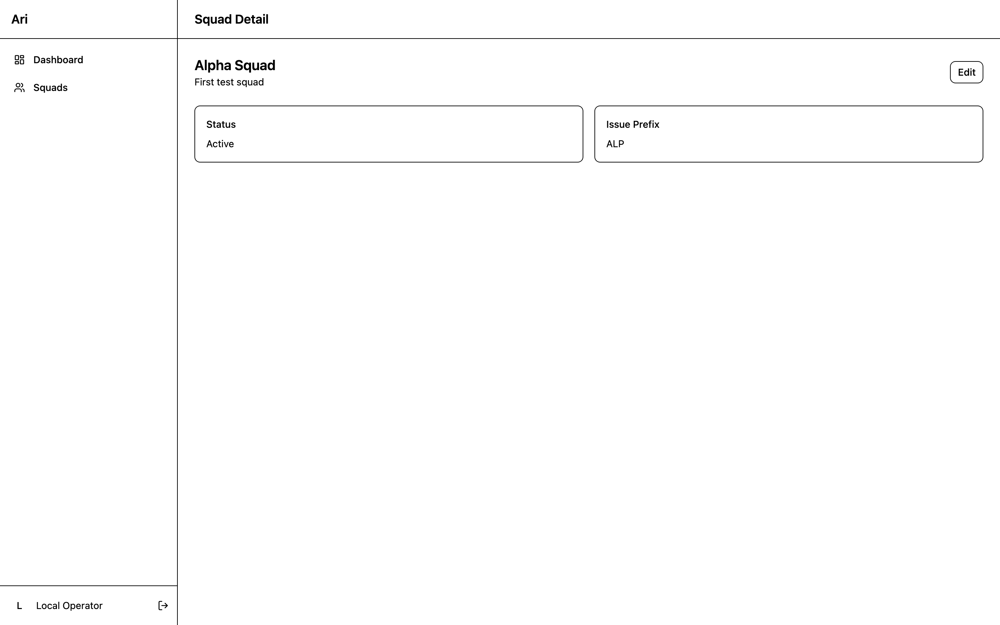
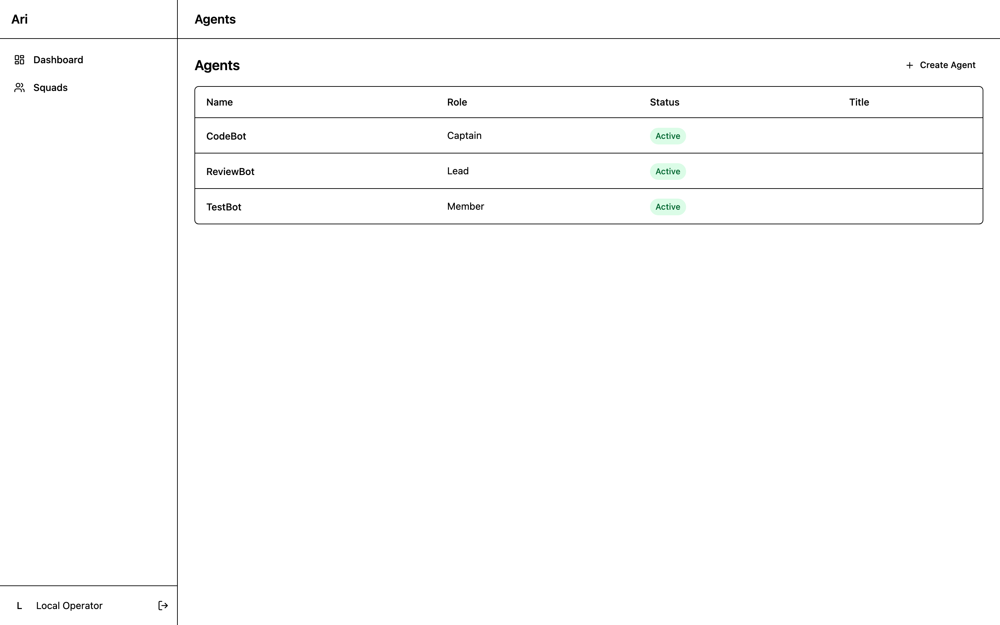
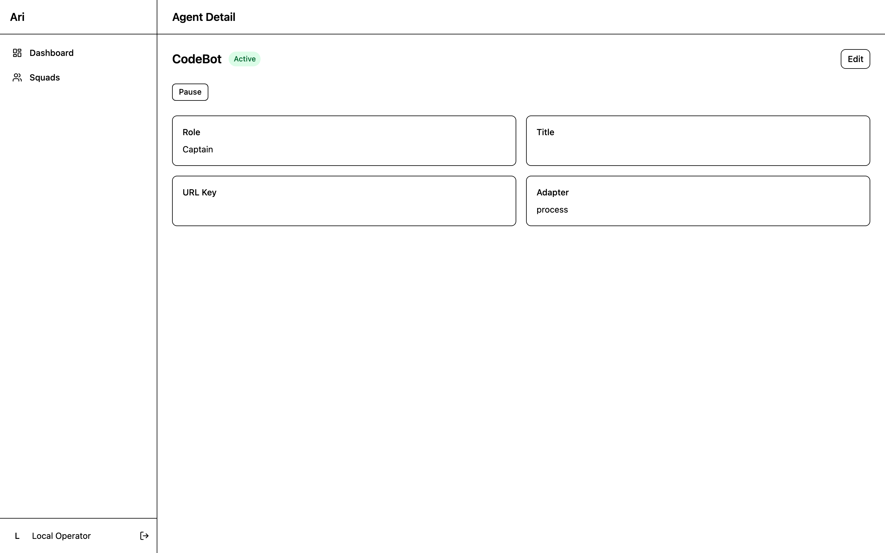
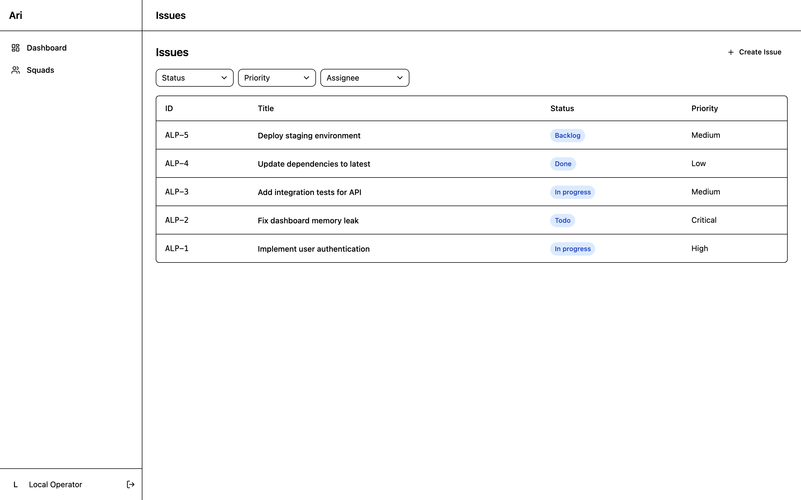
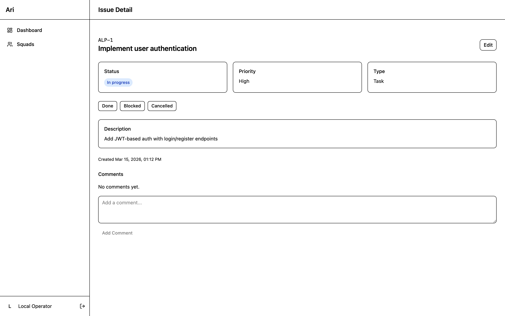

# Ari — UI Screenshots

> The self-hosted control plane for AI agent workforces.
> Single binary. Embedded Postgres. React dashboard. Zero external dependencies.

---

## Squad Overview



Each squad is an isolated workspace with its own agents, issues, and budget. Squads provide strict data isolation — agents in one squad can never access another squad's data.

---

## Agent Workforce



Agents are organized in a strict hierarchy: **Captain** leads the squad, **Leads** manage sub-teams, and **Members** execute tasks. Each agent has a real-time status indicator that updates via Server-Sent Events — no polling required.

---

## Agent Detail



Full agent profile with role, adapter configuration, and lifecycle controls. Agents can be paused, resumed, or terminated directly from the UI. The status badge updates in real-time as agents transition between states (active, running, idle, error, paused).

---

## Issue Tracker



Jira-style issue tracking purpose-built for AI agents. Issues use familiar identifiers (ALP-1, ALP-2, ...) and flow through a full lifecycle: Backlog → Todo → In Progress → Done. Filter by status, priority, or assigned agent. When an issue is assigned to an agent, Ari automatically wakes the agent to begin work.

---

## Issue Detail



Each issue shows its status, priority, type, and description with one-click status transitions. Agents and humans can add comments. When an agent marks a task as done via the API, the UI updates instantly through SSE.

---

## The Golden Journey

The core value proposition — fully automated end-to-end:

```
Create Squad → Add Agent → Create Issue → Assign to Agent
    → System auto-wakes agent
    → Agent reads task context via GET /api/agent/me
    → Agent resolves issue
    → Agent marks done via PATCH /api/agent/me/task
    → UI updates in real-time via SSE
```

All screenshots captured at 2x retina resolution (2880x1800).
